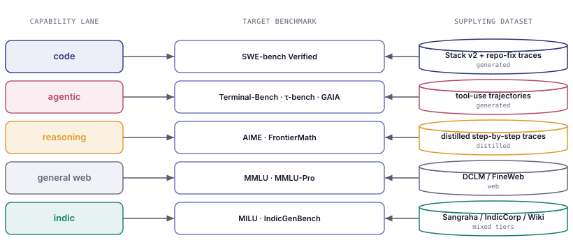
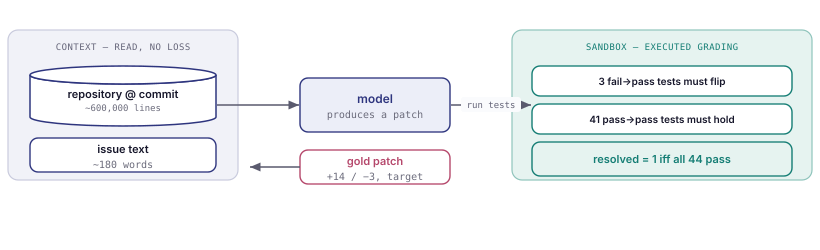
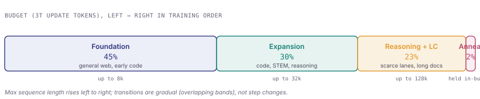

<!-- Generated by generate_v5_readme.py — mirrors v5_playbook.html ("V5 Plan — Proposal"). -->
# V5 Plan — Proposal

*The recommended order of construction, and the supply analysis that constrains the allocation. Quantities use an illustrative 3-trillion update-token budget.*

> This README mirrors the interactive page **[v5_playbook.html](./v5_playbook.html)** (nav tab: *V5 Plan — Proposal*). The full submittable specification is **[V5_PLAN.md](./V5_PLAN.md)**, and the arithmetic is reproduced and self-checked by **[mixture.py](./mixture.py)**.

---

## 1. Define the target benchmarks

Large-scale pretraining is ordinarily evaluated after the fact. A corpus is assembled from whatever data is available, a model is trained on it, and its capabilities are measured only once training is complete. Under this ordering, evaluation is a diagnosis rather than a design target, and the composition of the corpus — which datasets to acquire, how many tokens to allocate to each, and in what order to present them — is left unconstrained by the capabilities the model is ultimately meant to have. Two data recipes that produce very different models are, at the point of the design decision, indistinguishable.

We invert this ordering. Before any data is assembled, we fix a closed set of benchmarks that defines the model's intended capabilities, and we treat every subsequent decision about the corpus as a choice to be justified by its measurable effect on that set. A benchmark, throughout, is an executable test: SWE-bench presents a model with a real repository bug and grades the patch it returns by running hidden unit tests, so a score reflects behaviour rather than recognition. Composing the corpus backward from such tests makes the capability the fixed quantity and the data the free variable, and it renders a capability that no benchmark measures explicitly out of scope: the plan cannot claim to develop what it does not measure.

The inversion is only useful if the benchmark set is chosen well. A benchmark that a multiple-choice format lets a model pass by recognition, that a human rater must score, that already sits in the training crawl, or that the frontier has already saturated, provides no usable gradient for corpus design. Section 1.2 therefore states an explicit admission rule, and the remainder of the section applies it: §1.3 and §1.4 record the qualifying benchmarks with their sizes, grading metrics, and current best scores; §1.5 traces a single graded instance end to end, so that the loss-bearing token accounting used in later sections rests on an observed example rather than an assumption; §1.6 names the small-scale proxies used during validation; and §1.7 states the limits of the method. Figures were collected in July 2026 and are cited at the end of the section; where a state-of-the-art score is moving quickly, its date is attached to the number so that the claim remains checkable.

### 1.1 Target benchmarks and performance commitments

Table 1 fixes the targets of the programme. For each benchmark it records the property that qualifies it as a target, the capability that a strong score certifies, the data lever by which the plan intends to move the score, the current best public result, and the result this programme commits to. The columns are the argument of the section in compressed form: §1.2 justifies the second column, §1.3–1.5 substantiate the fifth, and the remaining sections of the plan are the means of reaching the sixth.

| Benchmark / lane | Why selected | Capability achieved | How (data lever) | Industry best (dated) | V5 target |
|---|---|---|---|---|---|
| **SWE-bench Verified** <br>`code` | Execution-graded on real repository bugs; contamination-resistant via the temporal Live variant. | Autonomous repository-level bug fixing. | Stack v2 plus generated issue→patch→test trajectories. | ~76% pass@1 (Jan 2026) | **≥ 50% resolved at 40B** |
| **Terminal-Bench v2** <br>`agentic` | Scores multi-step tool use in a real sandbox, not isolated API calls. | Planning and acting across a terminal session. | Generated plan→act→reflect trajectories, loss-masked on model turns. | frontier well below human | **~30% task success at 40B** |
| **τ-bench** <br>`agentic` | Grades whole multi-turn dialogues under pass^k, penalising unreliable behaviour. | Reliable tool-using assistants. | Synthetic tool-use dialogues paired with programmatic verifiers. | retail ~60% → 25% (pass^1→pass^8) | **~45% pass^1 at 40B** |
| **AIME** <br>`reasoning` | Integer-answer competition mathematics, exact-match and year-rotated (fresh each year). | Multi-step mathematical reasoning. | Distilled step-by-step solution traces, banded by reasoning depth. | high for reasoning models; year-rotated | **~40% on the held-out year** |
| **FrontierMath** <br>`reasoning` | Research-level mathematics with large headroom; solutions withheld from training. | Deep, original reasoning. | Distilled expert traces plus tool-augmented reasoning. | 25–40% Tier 4 (mid-2026) | **~15% Tiers 1–3** |
| **MMLU-Pro** <br>`general web` | Broad knowledge that still has headroom, unlike the saturated original MMLU. | General knowledge and a regression guard for unlisted capabilities. | High-quality deduplicated web (DCLM / FineWeb). | harder than MMLU; headroom remains | **≥ 65%, no regression vs baseline** |
| **MILU** <br>`indic` | Native Indic-language examinations across 11 languages, not translated English. | Indic knowledge and comprehension. | Sangraha / IndicCorp / Wikipedia plus verified Indic textbooks. | below English MMLU | **best open-weight Indic; ~60% macro-avg** |
| **IndicGenBench** <br>`indic` | Measures generation across 29 languages, not only recognition. | Fluent Indic generation and translation. | Verified and translated Indic tiers, with a per-language worst-case floor. | reference-based (chrF / ROUGE) | **macro-avg + worst-language reported; chrF above baseline** |

**Table 1.** Target benchmarks, the capability each certifies, the data lever intended to move it, and the committed target. Industry-best figures are the July 2026 public state of the art (inventory in §1.4; sources at the end of the section). The committed targets are stated for the 40B flagship; their direction is validated at 1B and 3B before full-scale commitment (§10), and they remain provisional until that validation.

### 1.2 Selection procedure

A benchmark qualifies as a target only if it passes five tests. The tests exist because the usual failure of a backward-composed plan is not a missing benchmark but an unsuitable one — a test that a model can pass without holding the capability, or one whose score cannot be trusted or improved. Each test below is stated once and then applied to a benchmark it admits and one it rejects.

**1. Direct measurement.** The benchmark must exercise the capability itself, not a proxy for it.

> ✅ **Admitted — SWE-bench.** The model receives a real bug report and the full repository, must return a code patch, and 44 unit tests are executed on that patch. Fixing the bug is the capability; running the tests measures it directly.
> ✗ **Rejected — a Python quiz.** *"Which keyword defines a function? (a) def (b) func (c) function (d) lambda"* — a model can pick (a) from memory while being unable to write a function that runs. The quiz measures recognition, which only correlates with the skill we want.

**2. Machine-checkable metric.** The score must be produced by a program — executing code, or matching against a known answer — not by a person or a model reading the output and forming a judgement. A mechanical check has no discretion: the answer is right or wrong, and re-running it yields the same score.

> ✅ **Admitted — GSM8K.** Each grade-school word problem has one correct number; suppose it is `18`. The model writes out its working and ends with a final number, and the harness does exactly one thing: extract that number and test whether it equals 18. The check is deterministic, objective, and returns in milliseconds with no human and no second model in the loop.
> ✗ **Rejected — "rate this answer 1–5".** Grading means asking a judge — a person, or an LLM prompted to score. Judges disagree, and the same LLM judge run twice on the same answer can return 3 then 4, because it is not perfectly repeatable. The score then depends on who graded and when, not on the answer alone.

The consequence is practical, and it is the reason the test is strict. This plan is steered by many cheap experiments (§10): train a small model, measure a benchmark, adjust the data recipe, measure again. That loop only works if the measurement is repeatable. If recipe A scores 0.62 and recipe B scores 0.60 on GSM8K, the gap is real and re-running confirms it; under an LLM judge the same two-point gap could be nothing but the judge's noise, so a later run might reverse the ranking. An execution or verifier metric gives a stable signal to steer by; a rating gives a noisy one, and hundreds of downstream decisions cannot rest on noise.

**3. Contamination resistance.** The benchmark must have a held-out, temporal, or private variant, so that a high score cannot be obtained simply by having trained on the test.

Contamination is when the test questions, or their answers, accidentally end up in the training data. When that happens, the model can score high just by having memorised the answer key, not by having the skill; the score becomes a lie, because it measures recall of the test rather than capability. This is a real and common accident, because training data and public benchmarks are scraped from the same internet: if SWE-bench's 500 issues are sitting on GitHub and the corpus includes a scrape of GitHub, the test leaks into training without anyone intending it. Contamination resistance means the benchmark is built so that this leak cannot help — there is a version of the test the model provably could not have seen. The rule admits three such versions:

- **held-out** — a portion of the items is kept out of what is published;
- **temporal** — the test items are newer than the training data;
- **private** — the answers are never published at all.

> ✅ **Admitted — SWE-bench Live.** It draws only GitHub issues created *after* the model's data cutoff. If training data stops in January 2026 and a test issue was filed in March 2026, its presence in training is impossible by the calendar — the guarantee needs no scanning.
> ✗ **Rejected — a fixed public quiz already in the crawl.** Its questions and answers are public and static, with no temporal or private variant to fall back on. A model can quietly memorise the answer key, report 95%, and leave no signal that the number is inflated.

**How we actually enforce it.** The passage above states the property; achieving it takes two separate jobs, because neither is sufficient alone.

*Job A — clean our training data (our responsibility).* This is the decontamination step in the pipeline (§11 of the plan, and the Decontam page). Before training, the corpus is actively searched for test items and the matches are deleted:

1. Collect every benchmark's test items (the 500 SWE-bench issues, the GSM8K questions, and so on).
2. For each training document, check whether it overlaps a test item, detected mechanically two ways: an **n-gram match** — do they share a long exact run of tokens (say a 13-token span)? — which catches a question copied verbatim into a blog post; and a **near-duplicate match** — are they almost the same after light rewording, measured by a similarity hash such as MinHash? — which catches paraphrased or reformatted copies an exact match would miss.
3. Any document that matches a test item is removed before it is ever trained on.

Job A is therefore a filter we run: `test items in → scan corpus → drop contaminated documents`.

*Job B — pick benchmarks that are hard to game (benchmark choice).* Job A can only remove leaks we can see; some we cannot — a subtly reworded answer, or a discussion that reveals the solution without quoting it. So we also prefer benchmarks that are structurally leak-proof, which is exactly what test 3 admits. **Temporal** benchmarks such as SWE-bench Live use only issues created after our data cutoff, so their presence in training is physically impossible — the calendar guarantees it with no scanning, which is the strongest and cheapest form of resistance and the reason we favour Live/temporal variants. **Private** benchmarks such as GAIA withhold the answer key on their own grading server (you submit answers, it grades them, you never receive the key), so there is nothing to memorise.

*Why the rejected example fails both jobs.* A fixed public quiz already in Common Crawl has public, static questions and answers. Job A may miss reworded copies scattered across the web, and there is no temporal or private variant to fall back on, so a model can quietly memorise the answer key, report 95%, and leave us no way to tell the number is fake. That is why it is disqualified as a *target* — though it can still serve as a rough proxy (§1.6). Each admitted benchmark in §1.4 records the specific decontamination rule it relies on, and both jobs are applied together.

**4. Public and reproducible.** The items, harness, and metric must be published, so that a reported number can be rerun by anyone. A benchmark qualifies as a target only if three things are public:

- **Items** — the actual questions or tasks (the 164 HumanEval problems, the 500 SWE-bench issues). Without them you do not know *what* was tested.
- **Harness** — the grading program that feeds each item to the model, collects the answer, and runs the check (the test runner, the sandbox, the answer-matcher). Without it you do not know *how* it was graded — the prompt, the number of attempts, what counted as a pass.
- **Metric** — the exact formula turning outcomes into a score (pass@1, resolved rate, accuracy). Without it a figure like "92%" has no fixed definition.

With all three public the number is falsifiable: anyone can re-run it and confirm or refute it. With any missing, it is a claim rather than a measurement.

> ✅ **Admitted — HumanEval.** The 164 problems and the grading harness are on GitHub, and the metric (pass@1) is defined; anyone reruns them and gets the same figure.
> ✗ **Rejected — a vendor eval reported only as "92%".** No items (what was tested?), no harness (which prompt, how many samples?), no metric definition (92% of what?). No outsider can reproduce it.

**What this buys us.** Two things depend on it. First, our own reported scores must be credible: when the plan states that the 40B model resolves 50% of SWE-bench, a reviewer must be able to re-run our evaluation and obtain 50% as well. Second, comparison must be apples-to-apples: to claim we beat a given result, our model and that result must be graded by the *same* published items, harness, and metric — a secret "92%" cannot be lined up against ours when its prompt, sampling, and metric are unknown.

**How we plan to do it.** For every benchmark we adopt:

1. **Admit only public item + harness + metric benchmarks** — openly available, for example in a GitHub repository. This is the filter test 4 applies.
2. **Pin the exact version.** We record the specific release or commit of the harness (for example, `SWE-bench harness @ commit abc123`), because a benchmark's grading code changes over time and an unpinned "76%" is not reproducible six months later.
3. **Re-run the harness ourselves for the baselines.** Rather than quoting a vendor's self-reported figure, we run the same public harness on the reference and frontier models to produce the industry-best column ourselves — so both sides of every comparison are measured identically.
4. **Freeze and publish our eval configuration.** The prompt template, few-shot count, sampling temperature, and pass@k are fixed and published alongside the harness commit. That configuration is what makes our numbers reproducible by a reviewer.
5. **Record all of this per benchmark in the §1.4 inventory** (metric + harness + decontamination rule), so the provenance of every number is on the page.

**5. Headroom.** The frontier score — the best result any current model achieves on the benchmark, that is, the state of the art — must sit below about 90%, or there is no gradient left to optimise against.

Headroom is the room a benchmark still has to improve. We steer the plan by measuring how a change in the data recipe moves a score (§10), and a benchmark can only guide us if its score can actually move. When the best systems already sit near the top — a *ceiling effect* — the score is pinned, so two recipes that differ in quality both land at roughly the same number and the benchmark cannot tell them apart. In optimisation terms the surface is flat: no gradient, nothing to climb. A benchmark that the frontier has saturated is a settled question, not a design target.

The same failure occurs at the opposite end. A benchmark that is far too hard for the scale being measured returns near-zero for every recipe — a *floor effect* — and is equally uninformative; this is why the headline benchmarks, which read ~0% at 1B, are paired with easier proxies for the small-scale runs (§1.6). A useful target sits in the informative middle band at the scale where it is measured: high enough off the floor to register, far enough below the ceiling to have somewhere to go.

> ✅ **Admitted — FrontierMath Tier 4.** The best systems score 25–40% (mid-2026). The score sits in the middle band, so an improvement from 30% to 40% is real, measurable signal that separates a better recipe from a worse one.
> ✗ **Rejected as a primary target — original GSM8K.** Frontier models already reach ~97%; moving 97.0 to 97.3 tells us almost nothing, and recipe differences vanish into the ceiling. It remains useful as a small-scale proxy, where 1B models are far from saturating it (§1.6).

**How we plan to do it.** For every benchmark we adopt:

1. **Apply a headroom threshold.** A benchmark is admitted as a primary target only if the current frontier score is below roughly 90% — at least ~10 points of room to improve.
2. **Check headroom at the measurement scale, not only at the frontier.** A benchmark can have room at 40B yet be pinned to the floor at 1B; the score must fall in the informative middle band at the scale where the decision is actually made, or a proxy is used instead (§1.6).
3. **Prefer tiered or difficulty-graded benchmarks.** Suites with difficulty tiers (FrontierMath Tiers 1–4) or harder successors (MMLU-Pro over the saturated MMLU) keep a band with headroom available as models improve.
4. **Demote, do not delete, a saturated benchmark.** When a former target saturates it is reclassified from an optimisation target to a regression guard — kept in the evaluation to confirm we do not lose the capability, but no longer steered toward (this is the role MMLU now plays, and the demotion GSM8K has taken to a proxy).
5. **Track the frontier over time and rotate.** Frontier scores are re-checked at their stated dates; when a target crosses the saturation threshold, it is rotated to a harder successor (GSM8K → MATH → AIME / FrontierMath) so the lane always has a benchmark with headroom.

**Metadata record.** Each admitted benchmark is recorded with six fields. Filled in for SWE-bench Verified:

```
version .......... SWE-bench Verified (500), snapshot 2024-08
size ............. 500 issues
metric ........... resolved rate (all hidden tests pass)
best score (date)  ~76% pass@1 (Jan 2026)
decontamination .. repository-disjoint; prefer the Live / temporal variant
1B/3B proxy ...... HumanEval, MBPP
```

**One primary lane.** Each benchmark, and later each training document, is filed under exactly one primary lane. Take a concrete document: a 12,000-token Hindi tutorial that walks through fixing a Python sorting bug with step-by-step reasoning. It touches four capabilities at once — Indic, code, reasoning, and long-context. The rule files it under one primary lane (code, its core task) and stores the rest as tags `{language: hi, reasoning: yes, length: long}`.

> ✗ **Without the rule:** the same 12,000 tokens are counted in code *and* Indic *and* reasoning *and* long-context = 48,000 counted tokens, and the budget in §5 is inflated 4×.
> ✅ **With the rule:** 12,000 tokens counted once, under code; the tags still let the plan report how much code data is also Indic or long.

Writing $L(d)$ for the set of capabilities a document $d$ touches and $|d|$ for its token count, the naive count sums the document once per capability, while the one-lane rule counts it once:

$$C_{\text{naive}}(d)=\sum_{\ell\in L(d)}|d| = 4\times 12{,}000 = 48{,}000, \qquad C_{\text{one-lane}}(d)=|d| = 12{,}000.$$

### 1.3 The benchmark set



**Figure 1.** Composing backward. Each target benchmark (centre) fixes a capability lane (left); the supplying dataset (right) is then chosen so that training on it moves that benchmark. Section 2 formalises the right-hand column.

### 1.4 Benchmark inventory

| Benchmark | Lane | Size | Metric | Best score (date) |
|---|---|---|---|---|
| SWE-bench Verified | code | 500 verified GitHub issues | resolved rate (hidden tests pass) | ~76% pass@1, ~81% pass@3 (Jan 2026); frontier 71–77% |
| Terminal-Bench v2 | agentic | 89 terminal tasks | sandbox task success | hard; frontier well below human |
| τ-bench | agentic | 165 (115 retail, 50 airline) | pass^k (all k runs pass) | frontier pass^1 < 70%; GPT-4o retail 60% → 25% (pass^1→pass^8) |
| BFCL v4 | agentic | function-calling suite | weighted acc. (agentic 40%, multi-turn 30%) | continuous leaderboard |
| GAIA | agentic | 466 questions, 3 levels | exact-match (tools + web allowed) | humans ~92%; public agents trail |
| AIME | reasoning | 30 problems / year | accuracy | year-rotated; strong reasoning models high |
| FrontierMath | reasoning | 338 (295 Tiers 1–3 + 43 Tier 4) | accuracy | >50% Tiers 1–3, 25–40% Tier 4 (mid-2026); ~0–6% in 2025 |
| MMLU | general web | 15,908 Q, 57 subjects | accuracy | saturated at the top; kept for regression |
| MMLU-Pro | general web | 12,000+ Q, 14 domains | accuracy | harder than MMLU; still has headroom |
| MILU | indic | ~85,000 MCQs, 11 languages | accuracy | Indic understanding; below English MMLU |
| IndicGenBench | indic | generation, 29 languages | chrF / ROUGE / EM | reference-based; generative |

Two design consequences follow from how these benchmarks grade.

**First, the model is scored on what it produces, not on what it reads — so data is counted in loss-bearing tokens.** The code and agentic lanes are graded by execution (did the patch pass the tests? did the tool sequence complete the task?) and the reasoning lanes by exact answer (is the final number correct?). In every case the grade depends only on the tokens the model *generates*, never on the material it reads along the way — the tool outputs, error logs, and file dumps that fill an agent trajectory. Training is aligned to this: those read-only tokens are *masked*, meaning the model is not trained to reproduce them, and only its own generated actions and answers carry a training signal. Those trained-on tokens are the **loss-bearing tokens**, and there are far fewer of them than the raw trace size suggests — a 50,000-token trajectory may hold only a few thousand. Counting such a trajectory as 50,000 tokens of agentic data would overstate the real signal several-fold, so §3 budgets every lane in loss-bearing tokens rather than raw size. (This is the same correction as the SWE-bench trace in §1.5, where a 600,000-line repository is read but only a 17-line patch is trained on.)

**Second, the Indic lane needs two benchmarks and a two-number report, because recognising a language and writing it are different skills.** MILU is multiple-choice and measures understanding — whether the model can recognise the correct Hindi answer; IndicGenBench is generative and measures production — whether the model can actually write and translate fluent Hindi. Measured by MILU alone, a high score could describe a model that recognises Hindi but cannot write it, and the capability would look solved when it is not; pairing the two closes that gap. How the score is averaged across the roughly twenty-two languages matters just as much, so Indic is reported as two figures rather than one. The **macro-average** weights every language equally, so a strong Hindi result cannot mask weak low-resource languages the way a data-weighted average would; and the **worst-language figure** reports the single lowest-scoring language outright, because an average near 55% can still hide one language at 20%. For a model whose premise is broad Indic coverage rather than Hindi alone, the weakest language is the honest measure of success.

### 1.5 One instance, traced end to end



**Figure 2.** A single graded item. The repository and issue text are read as context (no loss is taken on them); the gold patch is the supervised target; grading executes 44 tests in a sandbox and returns one bit. A code sample therefore contributes far fewer loss-bearing tokens than its raw size suggests.

The item score is an indicator, and the benchmark score is its mean over the 500 instances:

$$\text{resolved}_i=\mathbb{1}\!\left[\textstyle\bigwedge_{t=1}^{44}\text{test}_t\text{ passes}\right],\qquad \text{resolved rate}=\frac{1}{500}\sum_{i=1}^{500}\text{resolved}_i=\frac{380}{500}=0.76.$$

This fixes three quantities the plan depends on. The trainable content per item is small: the 600,000-line repository is read as context, and the supervised target is a 17-line diff, so a code sample contributes far fewer loss-bearing tokens than its raw size implies (§3). The reward is verifiable, computed by executing 44 tests, so the same item can be scored inside a cheap proxy run. And the supplying dataset is defined by the target: Stack v2 provides raw code but not the issue-to-patch structure, so the code lane also requires generated repository-fix trajectories, recorded as a supply gap in §6.

### 1.6 Proxy benchmarks for the 1B and 3B runs

Every quantity in this plan is a hypothesis — that one data recipe beats another. Testing a hypothesis by training the full 40B model is far too expensive to repeat, so recipes are first compared on cheap runs at 1B and 3B parameters, and only the winner is committed to the full run; this is the validation protocol of §10. The difficulty is that the measurement has to work at that small scale, and the headline benchmarks do not: they are so hard that a 1B model scores near zero on all of them, and a benchmark on which every recipe scores zero cannot tell the recipes apart. This is the floor half of the headroom test (test 5) — a score pinned to the bottom carries no more signal than one pinned to the ceiling.

The two coding benchmarks make the contrast concrete. At 1B a model resolves **0 of 500** SWE-bench issues, because it cannot yet produce a working repository patch; the score is 0 for every recipe, so SWE-bench cannot separate them at this scale. On HumanEval — a much easier test of small, self-contained functions — the same 1B model solves roughly **15–20 of 164** problems, and that count *moves* with the recipe (a better code mixture might reach 20, a worse one 15). Because the number moves, it can rank the recipes. HumanEval is therefore the small-scale *proxy* for the code lane: an easier, same-capability stand-in that sits in the informative middle band at 1B, where the real target is stuck on the floor. Each lane names such a proxy.

The proxy is an *evaluation* set, not training data. Running it means scoring an already-trained model on a fixed public test (HumanEval's 164 problems are downloaded, not bought), which costs negligible compute and never touches the token budget; the proxy is never trained on, since that would be contamination (test 3). What costs compute is *training* the small 1B and 3B models — cheap only relative to the 40B run — and the proxy is simply the cheap ruler used to read the result.

|  | What it is | Cost | Budget? |
|---|---|---|---|
| **Training** | Feeding trillions of tokens to update the model's weights | Huge | **Yes — the 3T-token budget** |
| **Evaluating** <br>`HumanEval, SWE-bench` | Scoring an already-trained model on a fixed test | Tiny (e.g. 164 problems) | No — negligible, separate |

| Lane | Headline benchmark | 1B/3B proxy | Proxy size |
|---|---|---|---|
| code | SWE-bench Verified | HumanEval, MBPP | 164 / ~974 problems |
| reasoning | AIME, FrontierMath | GSM8K, MATH-500 | 1,319 test / 500 problems |
| general web | MMLU-Pro | MMLU | 15,908 questions |
| indic | MILU, IndicGenBench | MILU (subset) | subset of ~85k |
| agentic | Terminal-Bench, τ-bench | scripted tool-call success rate | in-house set |

The pairing keeps the compose-backward spine intact: the plan still *targets* the headline benchmark, but it *steers* the recipe using the proxy at small scale and *confirms* on the headline benchmark at full scale. The proxy is a cheap filter for killing bad recipes early, not a substitute for the real measurement, and it comes with a firm limit: a proxy establishes the **direction** of an effect and the **rank** of two recipes, never the absolute number, because both the absolute score and, occasionally, the ranking itself shift with scale. This is why §10 promotes a recipe on rank stability across the 1B and 3B runs rather than on any single proxy value.

### 1.7 What this method does not do

- **A benchmark set can be over-fit.** Composing data backward from a fixed set risks teaching the test format. For example, train on 5,000 paraphrased copies of the SWE-bench issue texts and the reported resolved rate can rise ten points while the model is no better at unseen bugs. §11 pairs this method with a decontamination policy and a private, temporally held-out set; without that pairing, a reported gain is not trustworthy.
- **It measures only listed capabilities.** Anything absent from the set is invisible to the plan. For example, nothing here measures legal drafting or Hindi poetry, so the plan cannot tell whether the model can do them. General-web coverage (MMLU, MMLU-Pro) is retained partly to guard against regressing capabilities no targeted benchmark names.
- **Generative Indic quality is only partly machine-checkable.** IndicGenBench uses reference-based metrics (chrF, ROUGE) that correlate imperfectly with human judgement. For example, two correct Hindi translations of one English sentence can score chrF 0.55 and 0.72 purely from word choice, so a lower score need not mean a worse translation. The Indic result therefore carries more uncertainty than the execution-graded lanes and is flagged as such.

*Sources: SWE-bench Verified ([Epoch AI](https://epoch.ai/benchmarks/swe-bench-verified), [Jimenez et al.](https://arxiv.org/abs/2310.06770)); Terminal-Bench ([arXiv](https://arxiv.org/abs/2601.11868)); τ-bench ([Sierra](https://github.com/sierra-research/tau2-bench)); BFCL ([Gorilla](https://gorilla.cs.berkeley.edu/leaderboard.html)); GAIA ([arXiv](https://arxiv.org/abs/2311.12983)); FrontierMath ([Epoch AI](https://epoch.ai/frontiermath/the-benchmark)); MMLU-Pro ([arXiv](https://arxiv.org/abs/2406.01574)); MILU ([arXiv](https://arxiv.org/abs/2411.02538)); IndicGenBench ([arXiv](https://arxiv.org/abs/2404.16816)).*

---

## 2. Map each benchmark to a dataset

Each target is associated with the dataset that develops the corresponding capability — a procedure sometimes termed composing backward. A capability lane without an identified source dataset is not a plan but an aspiration, and is recorded as such.

## 3. Establish the trainable inventory

Effective inventory is measured, not assumed. Published corpus sizes are upper bounds; the usable quantity is reduced by licensing, deduplication, quality filtering, contamination removal, and re-tokenisation. Two measures are recorded per lane: the number of samples (variety) and the number of tokens (depth). For chat and agent data, only the model-generated positions are supervised — user turns and tool outputs are loss-masked — so the loss-bearing token count is materially smaller than the raw trace size. In ordinary causal pre-training, by contrast, every position is a training target.

$$T_{\text{loss}}=\sum_{i=1}^{T_{\text{raw}}}\mathbb{1}\big[\text{position }i\text{ is model-generated}\big]\ \ll\ T_{\text{raw}}\ \ (\text{chat/agent SFT}),\qquad T_{\text{loss}}=T_{\text{raw}}\ \ (\text{plain pre-training}).$$

## 4. Specify the allocation

A share of the budget is assigned to each lane, summing to 100%, and each share is expressed in tokens so that it can be reconciled against inventory:

$$t_\ell = s_\ell\, B,\qquad \sum_{\ell} s_\ell = 1,\qquad B = 3\times 10^{12}\ \text{update tokens}.$$

## 5. Apply the selector keep-fraction and reconcile against supply

The online selector retains only a fraction of the data it screens; consequently the quantity that must be *presented* exceeds the quantity *trained* on. Reconciling presented tokens against unique available supply is the decisive check, and it materially changes the assessment of the code and STEM lanes:

$$\text{presented}_\ell=\frac{\text{trained}_\ell}{k_\ell}\ \xrightarrow{\,k_\ell=0.5\,}\ 2\,\text{trained}_\ell,\qquad \text{epochs}_\ell=\frac{\text{presented}_\ell}{U_\ell}\le 4,$$

where $k_\ell$ is the selector keep-fraction and $U_\ell$ the unique eligible supply; a lane is feasible only if it clears the four-epoch repetition limit.

| Lane | Share | Trained | Presented | Unique avail. | Status |
|---|---|---|---|---|---|
| General web | 37% | ~1110B | ~2220B | ~8,000B | **ENOUGH** |
| Code | 22% | ~660B | ~1320B | ~600B | **TIGHT** |
| STEM | 12% | ~360B | ~720B | ~350B | **TIGHT** |
| Agentic | 13% | ~390B | ~390B | ~0.08B | **INFEASIBLE** |
| Reasoning | 7% | ~210B | ~420B | ~30B | **STARVED** |
| Indic | 8% | ~240B | ~240B | ~150B | **TIGHT** |
| Safety | 1% | ~30B | ~30B | ~15B | **TIGHT** |

*Presented = trained ÷ selector keep-fraction. Status compares presented tokens against unique eligible supply and the permitted repetition limit (≤4 epochs).*

## 6. Classify lane feasibility

The reconciliation identifies which lanes are supply-constrained. The **agentic** lane is infeasible under current inventory: at approximately 2,000 trainable tokens per trajectory $\tau$, the requirement is on the order of $10^{8}$ trajectories, which cannot be obtained by scraping.

$$N_{\text{traj}}=\frac{t_{\text{agentic}}}{\tau}=\frac{0.13\times 3\times 10^{12}}{2{,}000}\approx 1.95\times 10^{8}.$$

The **reasoning** lane is starved. **Long context** is not represented as a lane at all: sequence length is a property that data in other lanes already possesses, and treating it as an independent lane double-counts tokens. It is instead specified as a per-phase packing constraint. The principal remedy for the constrained lanes is generation and distillation; the most efficient lever is trace design, since trajectories that include planning, reasoning, and reflection yield several times more trainable tokens per trajectory than bare tool calls.

## 7. Decompose the Indic allocation

The Indic allocation is reported across four provenance tiers. The verified tier binds hardest: genuinely verified material across the target languages amounts to only a few billion unique tokens, so at a repetition limit of four epochs the maximum trainable verified quantity is small.

$$T^{\text{ver}}_{\max}=4\,U^{\text{ver}},\qquad \sum_{j=1}^{22} m_j \le t_{\text{indic}} = 0.08\,B,$$

where $U^{\text{ver}}$ is unique verified supply and $m_j$ the token floor for language $j$. A flat per-language floor of $p\%$ of the total budget fails as soon as $22p \ge 8$ (i.e. $p \gtrsim 0.36\%$), because the floors alone would then consume the whole Indic allocation. Per-language protection is therefore expressed as minimum token counts, not as a per-language percentage of the total budget.

## 8. Specify floors and the annealing reserve

Protected minima are enforced at batch granularity rather than as run-level averages; a run-level floor permits the selector to suppress a lane throughout training and satisfy the constraint only in aggregate. Safety is represented as an explicit lane so that its floor is consistent with a mixture summing to 100%. The annealing reserve is held within the budget, not added to it, and its contribution is validated against a control run without annealing.

## 9. Define the curriculum phases



**Figure 3.** The four curriculum phases across the budget, in training order. Widths are proportional to each phase's share of the 3T tokens; maximum sequence length rises left to right, and the scarce and premium lanes are concentrated in the later phases. The budget-weighted average of the phase mixtures reproduces the global mixture.

The single mixture is expanded into a small number of phases — broad, general-web-dominant data first, followed by code, science, and reasoning, with the scarce lanes concentrated later and the premium data reserved for the final phase. Each phase specifies its own budget, maximum sequence length, and mixture summing to 100%; the budget-weighted average of the phase mixtures reproduces the global mixture. Transitions between phases are gradual, to avoid the gradient instability associated with abrupt distribution shifts. Difficulty is assigned by measurement — for example, the failure rate of a reference model, or pass@k on verifiable items — rather than by inspection, and the reasoning-depth label is defined by the shortest correct trace to avoid inducing length inflation.

$$s_\ell = \frac{\sum_{p} B_p\, s_{\ell,p}}{\sum_{p} B_p},\qquad \sum_{\ell} s_{\ell,p} = 1\ \ \forall p,$$

where $B_p$ is the budget of phase $p$ and $s_{\ell,p}$ the share of lane $\ell$ within it; this identity is what `mixture.py` checks.

## 10. Define the validation protocol

Every quantity is treated as a hypothesis and tested at the 1B and 3B scales before full-scale commitment. Evaluations are chosen to exhibit signal at those scales; the most demanding benchmarks return near-zero at 1B and are uninformative there. Capability contrasts are amplified (for example, 4% versus 12% Indic) to establish the direction of an effect, and recipes are promoted on rank stability across scales rather than on absolute scores, which shift with scale.

## 11. Prioritise data acquisition

The supply-constrained lanes define the acquisition queue for the cleaning pipeline, in order: agentic trajectory generation, reasoning-trace distillation, long-document collection, and additional verified Indic material (textbooks, government records, and news, since encyclopaedic text alone is insufficient). The mixture plan thereby determines the priorities of the upstream pipeline.

---

*The complete plan is provided as [V5_PLAN.md](./V5_PLAN.md), and the arithmetic above is reproduced and validated by [mixture.py](./mixture.py), which derives the global mixture from the phase mixtures, applies the selector keep-fraction, and exits with an error if any phase mixture does not sum to 100% or any lane is infeasible.*
